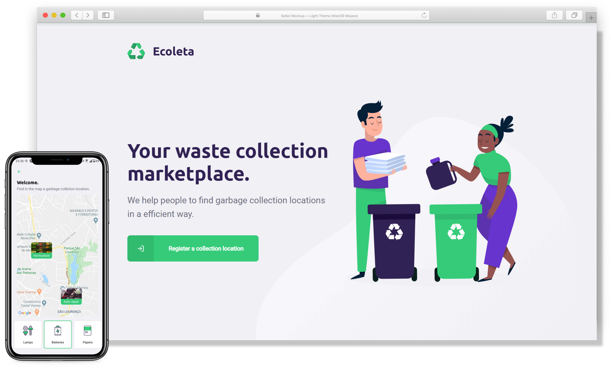
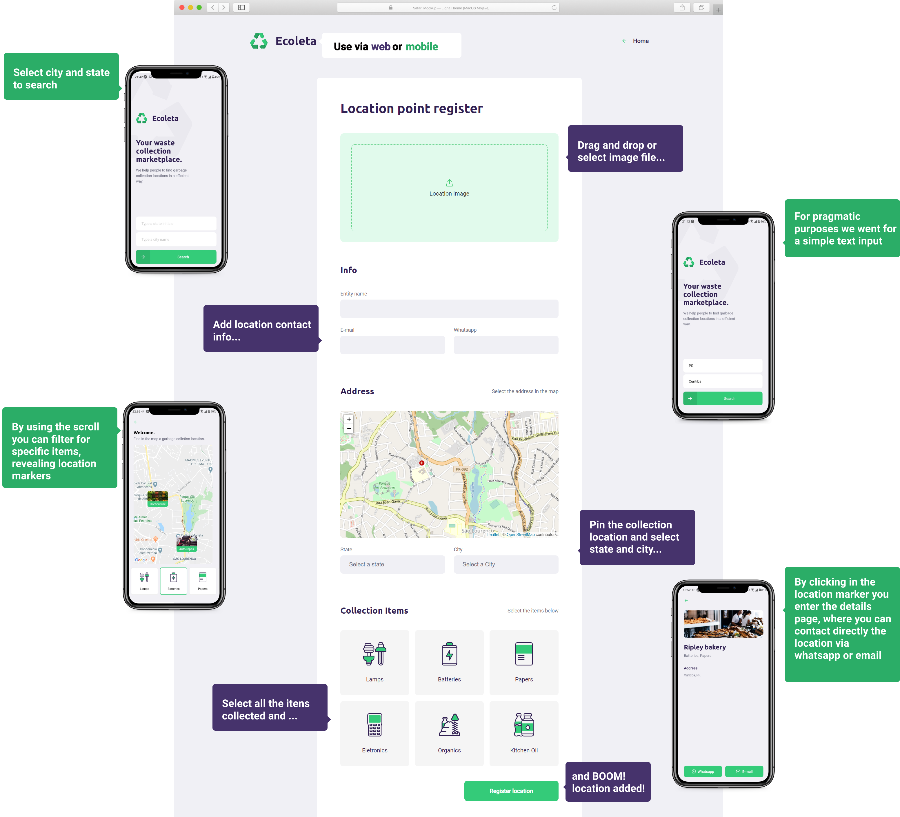

# Ecoleta :recycle: :iphone: :purple_heart: :computer: :satellite:

![NodeJS_Badge][server_nodejs_badge] ![React_Badge][web_react_badge] ![React_Native_Badge][mobile_react-native_badge] ![Node_Badge][node_version_badge]

Ecoleta is a small project focused on bringing a experience of easy registering and searching for garbage collection locations via website or mobile app.



This is a one week fullstack development project, composed of a web page, mobile app and web server with the use of TypeScript to create a Node.js server for the backend, web page with React.js and React Native supported with Expo for the mobile app.

This is the mobile React-native version developed for this project, you can check the web frontend at [Ecoleta web](https://github.com/Francozeira/nlw_web) and backend application at [Ecoleta backend](https://github.com/Francozeira/nlw_server), also, all assets were provided by [Rocketseat](https://rocketseat.com.br/).

A small list of tech characteristics and utils used in the project worth mentioning:

- Server
    - Express
    - Knex
    - SQLite
    - Brazilian Institute of Geography and Statistics API
    - Multer
    - Insomnia (API Design Plataform)
- Web
    - Figma (design prototype)
    - React
    - Fleaflet (Map Interface)
    - Google Fonts
- Mobile
    - React Native
    - Expo
    - Fleaflet (Map Interface)

## Project setup

Make sure to install all dependencies prior to run the application, on package.json file you can check all npm scripts used. Please note that this project was designed based on the use of Expo app to run and test the project.

### Compiles for development

```
# Start the Expo app at http://localhost:19002/:
$ npm start

# Use the QR code to run the app on your smatphone with Expo app
```

And that's basically it for starting the development of the project, pretty simple, huh?

------------

## :art: Images



> Full web and mobile experience

<!-- Badges -->

[node_version_badge]: https://img.shields.io/badge/node-12.17.0-green

[web_react_badge]: https://img.shields.io/badge/web-react-blue

[mobile_react-native_badge]: https://img.shields.io/badge/mobile-react%20native-blueviolet

[server_nodejs_badge]: https://img.shields.io/badge/server-nodejs-important